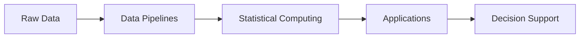

# Jean Mendes

### Statistical Programmer 

Building reproducible software and analytical systems for
**clinical research, healthcare and data-intensive problems.**

 

---

## About

I'm a developer working at the intersection of **statistical programming and clinical research**.

I build tools and analytical systems that transform complex data into **reproducible, scalable and maintainable workflows** — from data pipelines and statistical analysis to interactive applications and decision-support tools.

My main interests include **scientific computing, clinical programming, healthcare analytics and open-source software**.

---

## What I Build

My work and projects generally revolve around:

* **Statistical Programming** — R, SAS & Python
* **Clinical Programming** — CDISC SDTM & ADaM
* **Data Engineering** — SQL, analytical databases & data pipelines
* **Scientific Computing** — reproducible analytical workflows
* **Interactive Applications** — Streamlit, Shiny & Plotly
* **Open Source** — tools, libraries & experimental projects

---

## Tech Stack

<table>
<tr>
<td valign="top" width="33%">

### Languages

  

</td>

<td valign="top" width="33%">

### Data

  

`DuckDB` · `Arrow` · `Parquet`
`Pandas` · `Polars`

</td>

<td valign="top" width="33%">

### Development

  

`Streamlit` · `Shiny`
`Plotly` · `Quarto`

</td>
</tr>
</table>

---

## Clinical & Statistical Computing

<table>
<tr>
<td valign="top" width="50%">

### Clinical Programming

* CDISC SDTM
* CDISC ADaM
* Statistical Programming
* Clinical Data Engineering
* QC Programming
* Data Validation
* TLF Programming

</td>

<td valign="top" width="50%">

### Statistics

* Regression Analysis
* Longitudinal Analysis
* Mixed Models
* Survival Analysis
* Bayesian Statistics
* Experimental Design
* Statistical Computing

</td>
</tr>
</table>

---

## Data Engineering & Visualization

<table>
<tr>
<td valign="top" width="50%">

### Data Engineering

* PostgreSQL
* DuckDB
* SQL
* Apache Arrow
* Parquet
* Pandas
* Polars

</td>

<td valign="top" width="50%">

### Visualization & Apps

* Streamlit
* Plotly
* Shiny
* Quarto
* Graphic Walker

</td>
</tr>
</table>

---

## GitHub Activity

 

